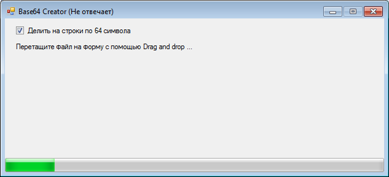

## Tools.Base64Creator

Скачать:

- [Tools.Base64Creator.v0.1.zip](/uploads/7f1ae9d92fc9f1ed76aa58044b37ace9/Tools.Base64Creator.v0.1.zip)

Позволяет преобразовывать файлы любого размера в формат Base64.

Нужно перетащить файл на форму приложения.

Рядом с файлом будет создан новый файл, к имени добавиться *.base64.txt*.

Тест на файле 1000 МБайт:

- размер входного файла: 0,97 ГБайт
- размер выходного файла: 1,34 ГБайт
- длительность конвертации: 6 минут 43 сек
- потребность в оперативной памяти: 23 МБайт
